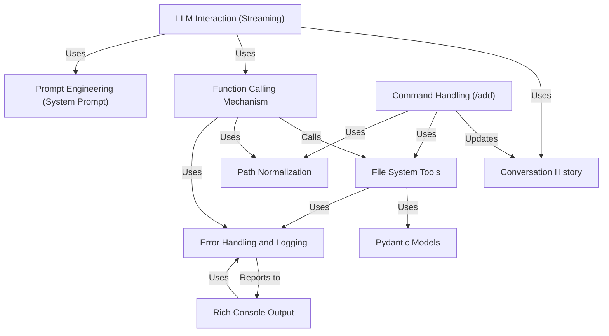

# AI Engineer v2 🐋

## Overview

AI Engineer v2 is a powerful AI-powered coding assistant that provides an interactive terminal interface for seamless code development. It integrates with AI's advanced reasoning models to offer intelligent file operations, code analysis, and development assistance through natural conversation and function calling.

## 🚀 Latest Update: Function Calling Architecture

**Version 2.0** introduces a big upgrade from structured JSON output to native function calling, providing:
- **Natural conversations** with the AI without rigid response formats
- **Automatic file operations** through intelligent function calls
- **Real-time reasoning visibility** with Chain of Thought (CoT) capabilities
- **Enhanced reliability** and better error handling

## Key Features

### 🧠 **AI Capabilities**
- **Elite Software Engineering**: Decades of experience across all programming domains
- **Chain of Thought Reasoning**: Visible thought process before providing solutions
- **Code Analysis & Discussion**: Expert-level insights and optimization suggestions
- **Intelligent Problem Solving**: Automatic file reading and context understanding

### 🛠️ **Function Calling Tools**
The AI can automatically execute these operations when needed:

#### `read_file(file_path: str)`
- Read single file content with automatic path normalization
- Built-in error handling for missing or inaccessible files
- **Automatic**: AI can read any file you mention or reference in conversation

#### `read_multiple_files(file_paths: List[str])`
- Batch read multiple files efficiently
- Formatted output with clear file separators

#### `create_file(file_path: str, content: str)`
- Create new files or overwrite existing ones
- Automatic directory creation and safety checks

#### `create_multiple_files(files: List[Dict])`
- Create multiple files in a single operation
- Perfect for scaffolding projects or creating related files

#### `edit_file(file_path: str, original_snippet: str, new_snippet: str)`
- Precise snippet-based file editing
- Safe replacement with exact matching

### 📁 **File Operations**

#### **Automatic File Reading (Recommended)**
The AI can automatically read files you mention:
```
You> Can you review the main.py file and suggest improvements?
→ AI automatically calls read_file("main.py")

You> Look at src/utils.py and tests/test_utils.py
→ AI automatically calls read_multiple_files(["src/utils.py", "tests/test_utils.py"])
```

#### **Manual Context Addition (Optional)**
For when you want to preload files into conversation context:
- **`/add path/to/file`** - Include single file in conversation context
- **`/add path/to/folder`** - Include entire directory (with smart filtering)

**Note**: The `/add` command is mainly useful when you want to provide extra context upfront. The AI can read files automatically via function calls whenever needed during the conversation.

### 🎨 **Rich Terminal Interface**
- **Color-coded feedback** (green for success, red for errors, yellow for warnings)
- **Real-time streaming** with visible reasoning process
- **Structured tables** for diff previews
- **Progress indicators** for long operations

### 🛡️ **Security & Safety**
- **Path normalization** and validation
- **Directory traversal protection**
- **File size limits** (5MB per file)
- **Binary file detection** and exclusion

## Getting Started

### Prerequisites
1. **DeepSeek R1+ API Key**: Get your API key from [DeepSeek Platform](https://platform.deepseek.com), or from OpenRouter, i.e. https://openrouter.ai/deepseek/deepseek-r1-0528:free (latest, as of 6/2025).
   Set this key as `DEEPSEEK_API_KEY` in your `.env` file. For other models/providers, set the appropriate API key environment variable that LiteLLM expects (e.g., `OPENAI_API_KEY`).
2. **Python 3.11+**: Required for optimal performance

### Installation


1. **Clone the repository**:
   ```bash
   git clone <repository-url>
   cd ai-engineer
   ```

2. **Set up environment**:
   ```bash
   # Create .env file from .env.example
   cp .env.example .env
   ```

3. **Install dependencies** (choose one method):

   #### Using uv (recommended - faster)
   ```bash
   uv venv
   uv run ai_eng.py
   ```

   #### Using pip
   ```bash
   pip install -r requirements.txt
   python3 ai_eng.py
   ```

### Usage Examples

#### **Natural Conversation with Automatic File Operations**
```
You> Can you read the main.py file and create a test file for it?

💭 Reasoning: I need to first read the main.py file to understand its structure...

🤖 Assistant> I'll read the main.py file first to understand its structure.
⚡ Executing 1 function call(s)...
→ read_file
✓ Read file 'main.py'

🔄 Processing results...
Now I'll create comprehensive tests based on the code structure I found.
⚡ Executing 1 function call(s)...
→ create_file
✓ Created/updated file at 'test_main.py'

I've analyzed main.py and created comprehensive tests covering all the main functions...
```

#### **Automatic Multi-File Analysis**
```
You> Compare the implementation in utils.py with the tests in test_utils.py

💭 Reasoning: I need to read both files to compare them...

🤖 Assistant> I'll read both files to analyze the implementation and tests.
⚡ Executing 1 function call(s)...
→ read_multiple_files
✓ Read files: utils.py, test_utils.py

🔄 Processing results...
After analyzing both files, I can see several areas where the tests could be improved...
```

#### **Manual Context Loading (Optional)**
```
You> /add src/

✓ Added folder 'src/' to conversation.
📁 Added files: (15 files)
  📄 src/utils.py
  📄 src/models.py
  ...

You> Now review this codebase structure

🤖 Assistant> I've reviewed your codebase and found several areas for improvement:

1. **Error Handling**: The utils.py file could benefit from more robust error handling...
```

## Technical Details

### **Model**: see LiteLLM supported providers and models here https://docs.litellm.ai/docs/providers
- Powered by AI-R1 with Chain-of-Thought reasoning
- Uses `litellm` as the interface library for robust communication with LLM APIs, enabling easy integration with AI and other potential models, see https://docs.litellm.ai/docs/providers for more details.
- The model name and API base URL are configurable via `LITELLM_MODEL` and `LITELLM_API_BASE` environment variables, respectively.
- Real-time reasoning visibility during processing
- Enhanced problem-solving capabilities

#### **Key Configuration Options (via `config.toml` or Environment Variables):**
*   `LITELLM_MODEL`: Specifies the language model to use (e.g., "deepseek-reasoner").
*   `LITELLM_API_BASE`: Sets the API base URL for the chosen model provider.
*   `LITELLM_MAX_TOKENS`: Sets the maximum tokens for the LLM response (default: 8192).
*   `REASONING_STYLE`: Controls the verbosity of the AI's reasoning output.
    *   `full` (default): Shows the complete reasoning text.
    *   `compact`: Shows "💭 Reasoning..." once, then prints dots (`.`) for progress.
    *   `silent`: Suppresses reasoning output entirely.
*   `REASONING_EFFORT`: Controls the AI's reasoning depth by modifying the prompt.
    *   `low`: Instructs the LLM for concise reasoning.
    *   `medium` (default): Standard reasoning detail.
    *   `high`: Instructs the LLM for highly detailed, step-by-step reasoning.
*   **Runtime Configuration (`/set` command)**: Many of these settings, along with others, can be adjusted during a session using the `/set <option_name> <value>` command. This allows for dynamic control over the AI's behavior. Available options for `/set` include:
    *   `model`: Change the language model (e.g., `/set model gpt-4o`).
    *   `api_base`: Update the API base URL (e.g., `/set api_base https://api.example.com/v1`).
    *   `reasoning_style`: Adjust reasoning verbosity (`full`, `compact`, `silent`) (e.g., `/set reasoning_style compact`).
    *   `max_tokens`: Set maximum response tokens (e.g., `/set max_tokens 2048`).
    *   `reasoning_effort`: Control reasoning depth (`low`, `medium`, `high`) (e.g., `/set reasoning_effort high`).
    *   `reply_effort`: Define the desired effort/detail in AI replies (e.g., `/set reply_effort high`).
    *   `temperature`: Adjust model creativity/randomness, typically a float (e.g., `/set temperature 0.7`).


### **High-Level Architecture**
The following diagram illustrates the main components and their interactions within AI Engineer:



### **Function Call Execution Flow**
- Uses `litellm` as the interface library for robust communication with LLM APIs, enabling easy integration with AI and other potential models, see https://docs.litellm.ai/docs/providers for more details.
- Real-time reasoning visibility during processing
- Enhanced problem-solving capabilities

### **Function Call Execution Flow**
1. **User Input** → Natural language request
2. **AI Reasoning** → Visible thought process (CoT)
3. **Function Calls** → Automatic tool execution
4. **Real-time Feedback** → Operation status and results
5. **Follow-up Response** → AI processes results and responds

### **Streaming Architecture**
- **Triple-stream processing**: reasoning + content + tool_calls
- **Real-time tool execution** during streaming
- **Automatic follow-up** responses after tool completion
- **Error recovery** and graceful degradation

## Advanced Features

### **Intelligent Context Management**
- **Automatic file detection** from user messages
- **Smart conversation cleanup** to prevent token overflow
- **File content preservation** across conversation history
- **Tool message integration** for complete operation tracking

### **Batch Operations**
```
You> Create a complete Flask API with models, routes, and tests

🤖 Assistant> I'll create a complete Flask API structure for you.
⚡ Executing 1 function call(s)...
→ create_multiple_files
✓ Created 4 files: app.py, models.py, routes.py, test_api.py
```

### **Project Analysis**
```
You> /add .
You> Analyze this entire project and suggest a refactoring plan

🤖 Assistant> ⚡ Executing 1 function call(s)...
→ read_multiple_files
Based on my analysis of your project, here's a comprehensive refactoring plan...
```

## File Operations Comparison

| Method | When to Use | How It Works |
|--------|-------------|--------------|
| **Automatic Reading** | Most cases - just mention files | AI automatically calls `read_file()` when you reference files |
| **`/add` Command** | Preload context, bulk operations | Manually adds files to conversation context upfront |

**Recommendation**: Use natural conversation - the AI will automatically read files as needed. Use `/add` only when you want to provide extra context upfront.

## Troubleshooting

### **Common Issues**

**API Key Not Found**
```bash
# Make sure .env file exists with your API key
echo "DEEPSEEK_API_KEY=your_key_here" > .env
```

**Import Errors**
```bash
# Install dependencies
uv sync  # or pip install -r requirements.txt
```

**File Permission Errors**
- Ensure you have write permissions in the working directory
- Check file paths are correct and accessible

## Contributing

This is an experimental project showcasing AI reasoning model capabilities. Contributions are welcome!

### **Development Setup**
```bash
git clone <repository-url>
cd ai-engineer
uv venv
uv sync
```

### **Run**
```bash
# Run the application (preferred)
uv run ai-eng.py
```
or
```bash
python ai-eng.py
```

## Testing

This project uses `pytest` for unit testing and `pytest-cov` for coverage reports.

### **1. Install Testing Dependencies**
If you haven't already, install the testing tools into your virtual environment:

#### Using uv
```bash
uv pip install pytest pytest-cov +uv pip install .[test]
```

This command installs your project along with all dependencies listed under the [project.optional-dependencies.test] group in your pyproject.toml file, such as pytest and pytest-cov. + +After installing, you can ensure your uv.lock file accurately reflects all installed dependencies (including extras):
```bash
uv lock
```

If you need to synchronize an environment strictly from an existing uv.lock file that includes extras, the exact command might vary based on your uv version. For many versions, uv pip sync --all-extras or uv pip sync --extra <name> would be used, but if these flags are not supported by your uv version (as indicated by uv pip sync --help), re-running uv pip install .[test] is a reliable way to ensure test dependencies are present.

#### Using pip
```bash
pip install pytest pytest-cov +pip install .[test]
```

2. Run Tests

#### Using uv
```bash
uv run pytest +python -m pytest
```

##### To get a coverage report: 
```bash
uv run pytest --cov=ai_eng --cov-report=html tests/ +python -m pytest # Coverage options are picked from pyproject.toml
```

This will generate an HTML coverage report in an htmlcov/ directory.

```bash
#### Using pip (ensure your virtual environment is activated)
pytest
```

##### To get a coverage report:
```bash
pytest --cov=ai_eng --cov-report=html tests/
```

### 3. Testing Network Tools (MCP Mock Server)

To test the connect_local_mcp_stream and connect_remote_mcp_sse tools, you can use the provided mock server (mock_mcp_server.py).

Steps:

1. Install Flask:

If you don't have it in your environment, install Flask:
```bash
Using uv
uv pip install Flask
Or using pip
pip install Flask
```

2. Run the mock server:

Open a terminal, navigate to the project root, and run:
```bash
python mock_mcp_server.py
```
The mock server will start, typically on http://localhost:1957.

3. Run AI Engineer:

In another terminal, run the AI Engineer application:
```bash
Using uv (from project root)
uv run ai_eng.py
Or using python
python ai_eng.py
```

4. Test with prompts in AI Engineer:

Interact with the AI using prompts like these:
```
You> Connect to the local stream at http://localhost:1957/local-stream and show me the data.
```
```
You> Monitor the SSE events from http://localhost:1957/remote-sse and give me a summary of the first 5 events.
```
```
You> What's happening on the SSE feed at http://localhost:1957/remote-sse? Limit to 2 events and use a 5 second timeout.
```

## License

This project is licensed under the MIT License - see the [LICENSE](LICENSE) file for details.

This project is experimental and developed for testing AI reasoning model capabilities, however it uses LiteLLM to take advantage also of other providers and models, see https://docs.litellm.ai/docs/providers for more details.

---

> **Note**: This is an experimental project developed to explore the capabilities of AI's reasoning model with function calling. The AI can automatically read files you mention in conversation, while the `/add` command is available for when you want to preload context. Use responsibly and enjoy the enhanced AI pair programming experience! 🚀
