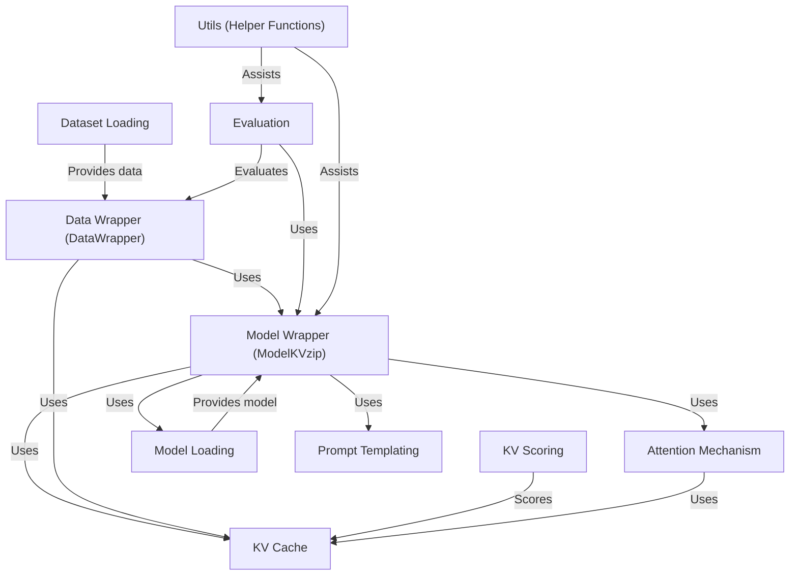
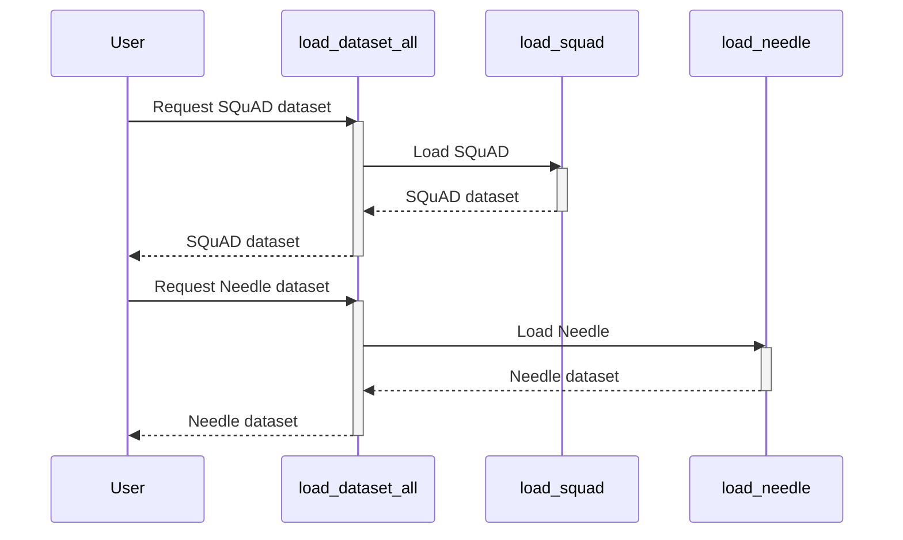
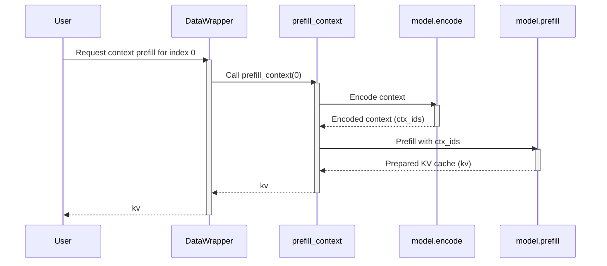
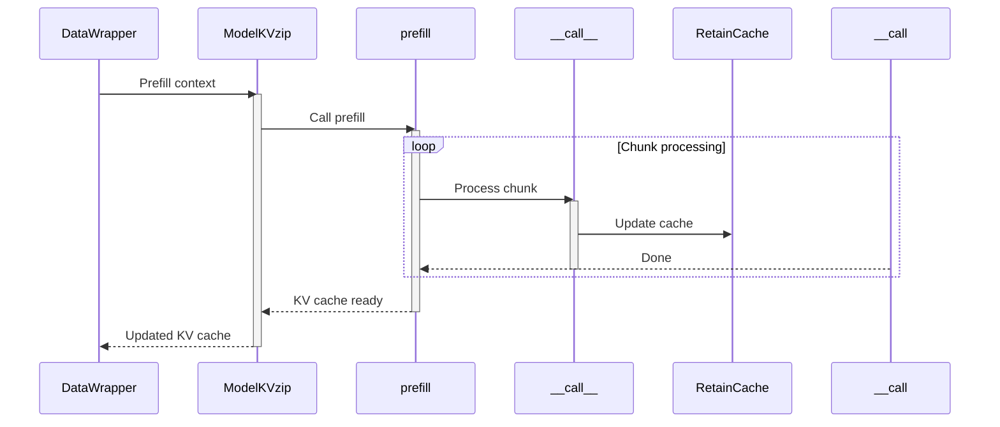
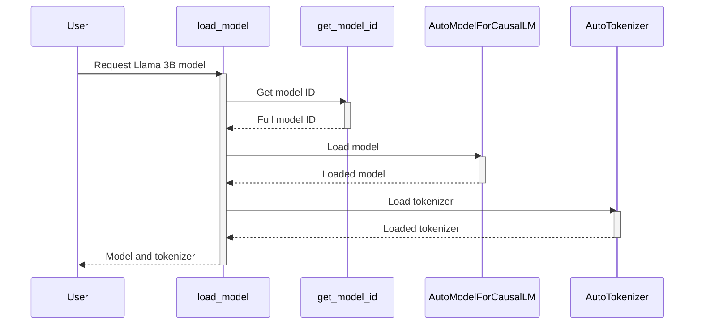
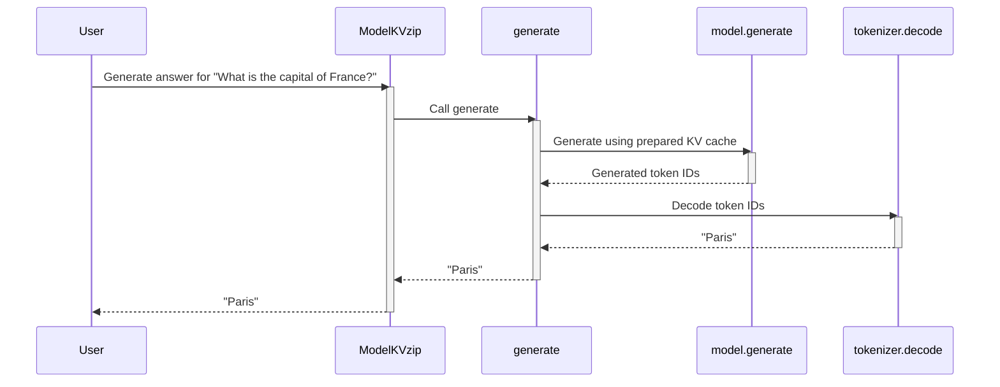
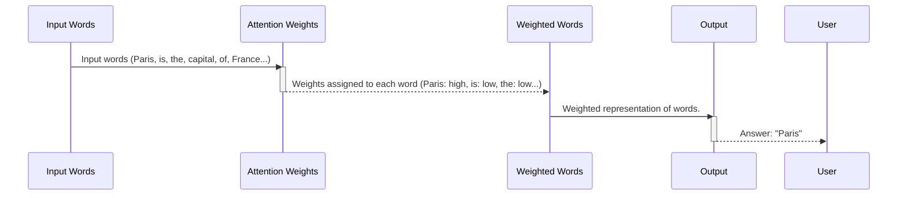
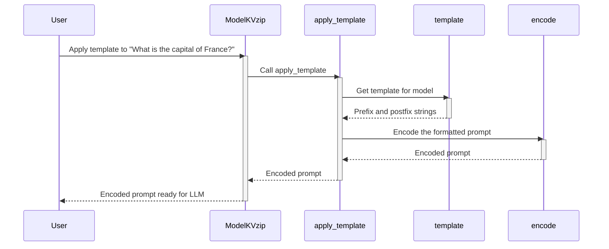
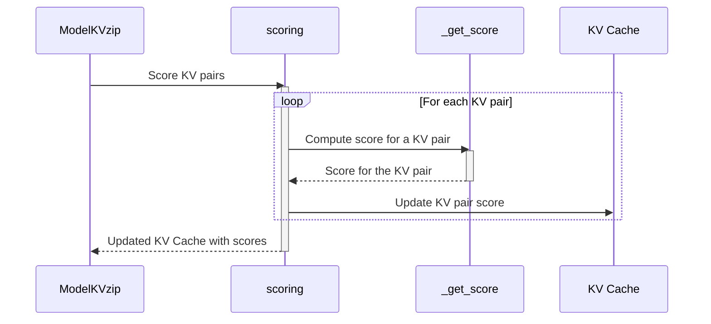
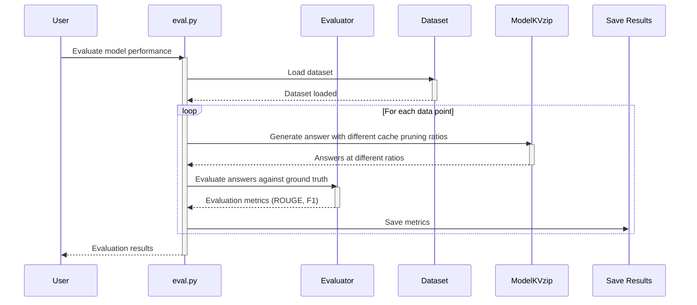

# Library: KVzip

KVzip is a project that improves the efficiency of *large language models (LLMs)* by using a **key-value (KV) cache**.  It *speeds up* LLM processing by storing frequently accessed information, and offers different caching strategies (*evict*, *retain*, *hybrid*) for optimal performance.  The project also includes tools for *dataset management*, *model loading*, and *evaluation*.


**Source Repository:** [https://github.com/snu-mllab/KVzip](https://github.com/snu-mllab/KVzip)



## Chapters

1. [Dataset Loading
](01_dataset_loading_.md)
2. [Data Wrapper (DataWrapper)
](02_data_wrapper__datawrapper__.md)
3. [KV Cache
](03_kv_cache_.md)
4. [Model Loading
](04_model_loading_.md)
5. [Model Wrapper (ModelKVzip)
](05_model_wrapper__modelkvzip__.md)
6. [Attention Mechanism
](06_attention_mechanism_.md)
7. [Prompt Templating
](07_prompt_templating_.md)
8. [KV Scoring
](08_kv_scoring_.md)
9. [Evaluation
](09_evaluation_.md)
10. [Utils (Helper Functions)
](10_utils__helper_functions__.md)


---

Generated by [AI Codebase Knowledge Builder](https://github.com/The-Pocket/Tutorial-Codebase-Knowledge)# Chapter 1: Dataset Loading

This is the first chapter of our KVzip tutorial!  We'll start by learning how to load different datasets, which is the crucial first step in any machine learning project. Think of this as preparing the ingredients before you start cooking – you need the right ingredients to make a delicious dish!

Let's say you want to evaluate your model's ability to answer questions based on a given context.  You'll need a dataset containing question-answer pairs along with the relevant context.  This is where the `Dataset Loading` component comes in. It's like a librarian who gathers books (datasets) from different libraries (data sources) to stock your library (your project).

Our `KVzip` project supports loading various datasets, such as SQuAD and Needle.  These datasets have different formats, but our `load_dataset_all` function handles the differences seamlessly.

The core function is `load_dataset_all` in `data/load.py`. Let's look at a simplified version:

```python
def load_dataset_all(name): #Simplified version, omitting some arguments
    if name == "squad":
        dataset = load_squad() # Loads SQuAD dataset
    elif name == "needle":
        dataset = load_needle() # Loads Needle dataset
    else:
        raise ValueError("Invalid dataset name!")
    return dataset

#Simplified load_squad and load_needle functions. Implementation details are hidden for brevity.
def load_squad():
    # ... loads SQuAD dataset ...
    return dataset

def load_needle():
    # ... loads Needle dataset ...
    return dataset
```

This code snippet shows the core logic.  It takes the dataset name as input (e.g., "squad", "needle"). Based on the name, it calls the appropriate loading function (e.g., `load_squad`, `load_needle`).  These functions (whose detailed implementation we'll skip for now) handle the specific data formats and load the data into a format our system can use. The final output is the loaded dataset, ready for use.


The actual implementation in `data/load.py` is more extensive and handles several different datasets.  It uses the `datasets` library to help with this process. The full implementation is slightly more complex, but the core principle remains the same:  load data based on the dataset name.

Here's a simple sequence diagram illustrating the process:



This shows how `load_dataset_all` acts as a dispatcher, choosing the correct loading function based on the user's request.

In summary, this chapter introduced the `Dataset Loading` component, which simplifies the process of loading different datasets for evaluation. It handles the complexities of various data formats, making it easy for you to focus on the core task of evaluating your model. In the next chapter, we'll explore how to use the [Data Wrapper (DataWrapper)](02_data_wrapper__datawrapper__.md) to further process and manage this loaded data.


---

Generated by [AI Codebase Knowledge Builder](https://github.com/The-Pocket/Tutorial-Codebase-Knowledge)# Chapter 2: Data Wrapper (DataWrapper)

After learning how to load datasets in [Chapter 1: Dataset Loading](01_dataset_loading_.md),  we're ready to organize and prepare this data for our large language model (LLM).  This is where the `DataWrapper` comes in.

Imagine you're baking a cake. You wouldn't just throw all the ingredients into the bowl at once, right? You'd measure them out, mix them in the correct order, and prepare them appropriately.  The `DataWrapper` does the same for your data, making sure it's in the perfect format for your LLM to "bake" a great response.

Let's say we want our LLM to answer questions based on a given context, using the SQuAD dataset we loaded in the previous chapter.  `DataWrapper` will help us efficiently manage and preprocess the data for this task.

The core function is `DataWrapper` in `data/wrapper.py`. Let's look at a simplified version focusing on the `prefill_context` and `generate_answer` methods:

```python
class DataWrapper():
    def __init__(self, dataname, dataset, model): #Simplified init
        self.dataset = dataset # The dataset loaded in Chapter 1
        self.model = model # The LLM model (explained in Chapter 4)
        # ... other details omitted ...

    def prefill_context(self, idx):
        data = self.dataset[idx] #Get a single data point
        ctx_ids = self.model.encode(data['context']) #Encode the context
        kv = self.model.prefill(ctx_ids) # Prepare the context for the LLM
        return kv

    def generate_answer(self, idx, kv):
        data = self.dataset[idx] #Get data point
        # ... other details omitted ...
        return inputs, info # inputs and info used for evaluation (chapter 9)
```

This simplified `DataWrapper` takes the dataset (from [Chapter 1: Dataset Loading](01_dataset_loading_.md)), the model (from [Chapter 4: Model Loading](04_model_loading_.md)), and prepares the data for the model. `prefill_context` encodes the context and prepares a `kv` object (explained later) which holds the context in a format suitable for the model.  `generate_answer` uses this prepared `kv` to generate answers.

Let's look at how this works with a sequence diagram:



This shows how `DataWrapper` uses helper functions to prepare the data before passing it to the model.

Now, let's look at a bit more detail into the `prefill_context` method from `data/wrapper.py`:

```python
    def prefill_context(self, idx: int, load_score=False) -> Union[RetainCache, EvictCache]:
        data = self.dataset[idx]
        ctx_ids = self.model.encode(data['context'])
        kv = self.model.prefill(ctx_ids, load_score=load_score)
        return kv
```
This function takes the index of the data point, gets the context, encodes it using the model's `encode` function, and uses the model's `prefill` function to create the `kv` object. This object (`RetainCache` or `EvictCache` from `attention/kvcache.py`) is a key-value cache that stores the context efficiently for the LLM.


In summary, the `DataWrapper` acts as a crucial intermediary, efficiently preparing your dataset for use with the LLM. It handles the complexities of data preprocessing, allowing you to focus on the higher-level tasks of model interaction and evaluation.  In the next chapter, we'll delve into the [KV Cache](03_kv_cache_.md), the efficient data structure used by `DataWrapper` to store and manage the processed data.


---

Generated by [AI Codebase Knowledge Builder](https://github.com/The-Pocket/Tutorial-Codebase-Knowledge)# Chapter 3: KV Cache

Following up from [Chapter 2: Data Wrapper (DataWrapper)](02_data_wrapper__datawrapper__.md), we now explore the heart of KVzip's efficiency: the KV Cache.  The `DataWrapper` prepares the data, but the KV Cache is where that data is cleverly stored for lightning-fast access by the language model.

Imagine a librarian who needs to find books quickly.  Instead of searching through countless shelves every time, they keep the most frequently requested books near the front desk. This "frequently requested" section is like our KV Cache! It stores frequently accessed information for your language model so it can respond quickly.

Our central use case will be answering questions based on a given context.  The context (e.g., a long document) might be too large for the model to process efficiently at once.  The KV Cache breaks down this large context into manageable chunks and stores them smartly for the model to access as needed.

The KV Cache stores data as *key-value pairs*, much like a dictionary. The "key" is something that uniquely identifies a piece of information, and the "value" is the information itself.  For example, the key might be a word's ID, and the value could be its corresponding representation in the model.

There are different types of KV caches in `KVzip`, each managing space differently:

* **Retain Cache:** Keeps *all* the key-value pairs in memory. It's simple and fast, but uses more memory. Think of this like the librarian keeping *all* frequently requested books close by—it's fast but requires a large space.

* **Evict Cache:**  Keeps only a certain number of key-value pairs. When the cache is full, it removes the least recently used pairs to make room for new ones. This is like the librarian having a limited space near the desk;  they will replace older books that haven't been requested recently to make room for newer ones.

* **Hybrid Cache:**  A combination of Retain and Evict. Certain portions of the data are always kept (retain), while others are managed dynamically (evict).  Think of this as having a large, always-available section and a smaller, more dynamic section of frequently-accessed books.


Let's see how a Retain Cache works in our question-answering example:

First, the `DataWrapper` (from [Chapter 2](02_data_wrapper__datawrapper__.md)) will pass a context to the `prefill` function of the `ModelKVzip` (explained later in this chapter):

```python
# Simplified version of prefill in model/wrapper.py
def prefill(ctx_ids, kv): # Omitting many parameters and details
    # ...
    for input_ids in chunk_fn(ctx_ids, chunk_size): #Process in chunks. Implementation details hidden
        self.__call__(input_ids, kv, update_cache=True) #Updates the KV Cache
    # ...
    return kv
```

This code snippet processes the context in chunks to handle its size. `self.__call__` updates the KV cache (`kv`) with each chunk's data.

Here's a sequence diagram illustrating this process:



The core of the KV cache implementation lies in `attention/kvcache.py`.  The `RetainCache` class (a simplified version is shown below) manages the storage and retrieval of key-value pairs:


```python
#Simplified RetainCache from attention/kvcache.py
class RetainCache(DynamicCache, KVScore): # Inherits from DynamicCache and KVScore
    # ...other details omitted...
    def update(self, key_states, value_states, layer_idx, cache_kwargs=dict()):
        # ... other details omitted ...
        self.key_cache[layer_idx] = torch.cat([self.key_cache[layer_idx], key_states], dim=-2)
        self.value_cache[layer_idx] = torch.cat([self.value_cache[layer_idx], value_states], dim=-2)
        return self.key_cache[layer_idx], self.value_cache[layer_idx]

```

The `update` method simply concatenates new key and value states to the existing cache.  The full implementation handles more complex scenarios, such as different model architectures and efficient memory management.


In summary, this chapter introduced the KV Cache, a crucial component for efficient language model processing.  We saw how it works with the `DataWrapper` and explored the differences between Retain, Evict, and Hybrid caches.  Understanding the KV Cache is fundamental to understanding KVzip's performance.  Next, we'll move on to [Chapter 4: Model Loading](04_model_loading_.md) to learn how to load the language models themselves.


---

Generated by [AI Codebase Knowledge Builder](https://github.com/The-Pocket/Tutorial-Codebase-Knowledge)# Chapter 4: Model Loading

Following up from [Chapter 3: KV Cache](03_kv_cache_.md), we're now ready to load and prepare our large language model (LLM).  This is the crucial step where we get our "engine" ready to answer questions!  Think of this chapter as preparing the car for a race—we need to make sure all its parts are working correctly before we can start driving.

Our central use case will be answering questions based on a given context using an LLM.  Before we can even think about answering questions, we first need to load and configure the LLM itself.  This is the job of the `Model Loading` component.

The core function is `load_model` in `model/load.py`. It handles different types of LLMs, different sizes, and even different quantization methods (how the model's data is compressed to make it smaller and faster).

Let's say we want to use the Llama 3B model.  Here's how we load it using a simplified version of `load_model`:

```python
def load_model(model_name: str, dtype=None, **kwargs): #Simplified version, omitting many details
    model_id = get_model_id(model_name) #Gets the full model ID from an abbreviation if necessary
    model = AutoModelForCausalLM.from_pretrained( #Loads the model
        model_id,
        torch_dtype=get_dtype(dtype), #Gets the data type (e.g., fp16, fp32)
        device_map="auto", #Automatically distributes the model across available GPUs
    )
    tokenizer = AutoTokenizer.from_pretrained(model_id) #Loads the tokenizer
    model.eval() #Sets the model to evaluation mode
    return model, tokenizer
```

This simplified code snippet shows the core steps: it takes the model name, gets the full model ID (handling abbreviations like "llama3.1-8b"), loads the model using the `transformers` library, loads the corresponding tokenizer, and sets the model to evaluation mode.  The full `load_model` function in `model/load.py` handles more complex scenarios, such as different quantization methods and special configurations for different model architectures.

Let's visualize the process with a sequence diagram:



This shows how `load_model` orchestrates the loading process.  It uses helper functions (`get_model_id`, `get_dtype`) and interacts with the `transformers` library to load the model and tokenizer.


Now let's look at a slightly more detailed piece of code, focusing on how different data types are handled:

```python
def get_dtype(name: str):
    if name == "fp32":
        return torch.float32
    elif name == "fp16":
        return torch.float16
    elif name == "bf16":
        return torch.bfloat16
    else:
        return None
```

This function maps the user-specified data type (e.g., "fp16") to the corresponding PyTorch data type.  This is important for controlling memory usage and computation speed.


In summary, this chapter showed how to load and configure different LLMs using the `Model Loading` component.  It simplifies the process, handling various model architectures and quantization methods, and ensuring the model is ready for use.  Next, we'll explore the [Model Wrapper (ModelKVzip)](05_model_wrapper__modelkvzip__.md), which builds upon this loaded model to provide efficient integration with the KV cache and question answering.


---

Generated by [AI Codebase Knowledge Builder](https://github.com/The-Pocket/Tutorial-Codebase-Knowledge)# Chapter 5: Model Wrapper (ModelKVzip)

Following up from [Chapter 4: Model Loading](04_model_loading_.md), we'll now learn about the `ModelKVzip` wrapper.  This simplifies interacting with our loaded large language model (LLM) and the KV cache we learned about in [Chapter 3: KV Cache](03_kv_cache_.md).

Imagine you have a powerful, but complex, computer.  You don't want to deal with all its intricate settings every time you want to use it.  `ModelKVzip` is like a user-friendly interface for our LLM, making it easy to use for tasks like encoding text and generating answers.

Our central use case is still answering questions based on a given context. `ModelKVzip` makes this process smooth and efficient.

Let's say we want to answer the question "What is the capital of France?" given a context that mentions Paris as the capital.  Here’s how we use `ModelKVzip`:

First, we need to load a model and initialize `ModelKVzip`:

```python
from model.wrapper import ModelKVzip
model = ModelKVzip("llama3.1-8b") #Loads a specific LLM model
```

This code snippet loads a specific language model ("llama3.1-8b" in this case).  The `ModelKVzip` class handles the complexities of loading and managing this model.  Many other models are supported (as shown in [Chapter 4](04_model_loading_.md)).

Next, we’ll prepare the context and question:

```python
context = "France is a beautiful country. Its capital is Paris."
question = "What is the capital of France?"
```

Now, we use `ModelKVzip` to encode the context and generate an answer:

```python
kv = model.prefill(context) #Prepares the context for efficient access
query = model.apply_template(question) #Formats the question appropriately
answer = model.generate(query, kv=kv) #Generates the answer using the prepared context
print(f"Answer: {answer}")
```

This part uses the model to prepare the context using `prefill`. It then applies a template to the question using `apply_template` to format it correctly. Finally it generates the answer, utilizing `kv` for efficient access to the context.  The output will be "Answer: Paris".


Let's look at a simplified sequence diagram illustrating the `generate` method:




The `ModelKVzip` class uses functions from `model/wrapper.py`. The `generate` method orchestrates the generation process: it takes the formatted question and uses the model's `generate` function along with the pre-processed KV cache.  The decoded output is then returned.

The `prefill` function in `model/wrapper.py` is crucial for preparing the context efficiently:

```python
#Simplified prefill
def prefill(self, ctx_ids, ...):
    #...
    for input_ids in chunk_fn(ctx_ids, chunk_size):
        self.__call__(input_ids, kv, update_cache=True)
    #...
    return kv
```

This processes the context in chunks, updating the KV cache (`kv`) with each chunk. This uses the `__call__` method to perform the actual model computation with the KV cache.  The `chunk_fn` breaks down large contexts for efficient handling.


In summary, this chapter introduced the `ModelKVzip` wrapper, which provides a simplified interface for interacting with our LLM and the KV cache. It handles the complexities of encoding text and generating answers efficiently.  In the next chapter, we'll delve into the [Attention Mechanism](06_attention_mechanism_.md) to understand how the model processes information.


---

Generated by [AI Codebase Knowledge Builder](https://github.com/The-Pocket/Tutorial-Codebase-Knowledge)# Chapter 6: Attention Mechanism

Following [Chapter 5: Model Wrapper (ModelKVzip)](05_model_wrapper__modelkvzip__.md), we'll explore the core of how large language models (LLMs) understand context: the attention mechanism.  This is the "secret sauce" that allows LLMs to focus on the most relevant parts of a text when generating a response.

Imagine you're reading a long document and answering a question about it. You wouldn't reread the entire document; instead, you'd focus on the sentences most relevant to the question.  The attention mechanism does something similar for the LLM. It helps the model "pay attention" to the most important words and their relationships when generating text.

Our central use case remains answering questions based on a long context.  Let's say our context is: "Paris is the capital of France.  France is known for its cheese and wine."  If the question is "What is the capital of France?", the attention mechanism should help the model focus primarily on "Paris" and "France" to generate the correct answer.

The attention mechanism works by assigning weights to each word in the input.  These weights represent the importance of each word for understanding the current word being processed.  Words with higher weights receive more attention, while words with lower weights are largely ignored.  These weights are learned by the model during training.

Different implementations of the attention mechanism exist, affecting speed and memory usage.  KVzip uses efficient implementations like FlashAttention, which are optimized for faster processing and lower memory consumption.

Let's visualize a simplified attention mechanism in action:



This diagram shows that the input words receive weights, the model uses the weighted words to generate an answer, and then finally the answer is outputted.  The actual implementation is more complex, but this illustrates the core concept.

The core implementation of the attention mechanism in KVzip is within `attention/attn.py`.  This file contains functions like `llama_flash_attn2_forward`, `gemma3_attn_forward`, and `qwen3_flash_attn2_forward` which are responsible for performing the attention calculations using FlashAttention.  These functions are modified versions of the original implementations in the `transformers` library, optimized for KVzip's architecture.

Let's look at a simplified part of `llama_flash_attn2_forward`:

```python
def llama_flash_attn2_forward(...):
    # ... (Simplified code to calculate query, key, and value states) ...
    # Apply rotary embeddings (a positional encoding technique)
    query_states, key_states = apply_rotary_pos_emb(query_states, key_states, cos, sin)
    # ... (FlashAttention calculation using flash_attn_varlen_func) ...
    return attn_output, attn_weights # attn_output is the result of attention calculation
```

This snippet demonstrates some parts of the function. `apply_rotary_pos_emb` adds positional information using rotary embeddings, and `flash_attn_varlen_func` is the core FlashAttention function that calculates the attention weights and applies them.

The `monkeypatch.py` file is crucial for integrating the optimized attention mechanisms with different models (e.g., Llama, Qwen).  It replaces the standard attention functions of the underlying models with the faster KVzip versions.

```python
def replace_attn(model_id):
    if "llama" in model_id:
        transformers.models.llama.modeling_llama.LlamaAttention.forward = llama_flash_attn2_forward
    # ... (similar replacements for other models) ...
```

This function replaces the forward pass of the Llama model's attention module with our optimized version.


In summary, this chapter introduced the attention mechanism, a fundamental component of LLMs, and showed how KVzip leverages optimized implementations like FlashAttention for efficient processing. We learned how the weights are assigned to different words and how the model uses this information to generate contextually relevant answers.  In the next chapter, we'll look at [Prompt Templating](07_prompt_templating_.md).


---

Generated by [AI Codebase Knowledge Builder](https://github.com/The-Pocket/Tutorial-Codebase-Knowledge)# Chapter 7: Prompt Templating

Following [Chapter 6: Attention Mechanism](06_attention_mechanism_.md), we'll learn about prompt templating. This crucial step prepares the input for your large language model (LLM), ensuring it understands the task and context.  Think of it like creating a perfect recipe for your LLM—you need the right ingredients (context and instructions) presented in the right way for it to produce the best results.


Our central use case is answering questions based on a context, as in previous chapters. Let's say we have a context about France and a question "What is the capital of France?". Simply feeding the context and question to the LLM might not yield the best results. Prompt templating helps structure the input to clearly define the task and guide the LLM's response.

Prompt templating involves creating a structured format for the input to the LLM. This format often includes placeholders for the context and the question, clearly separating them and specifying the desired output format.

Let's see a simple example.  Suppose we use a template like this:

```
Given the following context: {context}
Answer the following question: {question}
Answer:
```

Here, `{context}` and `{question}` are placeholders that will be filled with the actual context and question.  This structured input helps the model understand its task.

Now, let's see how we use this in code.  The `template` function in `model/template.py` helps generate different templates depending on the LLM you're using:


```python
# Simplified version of template function from model/template.py
def template(model_name, task):
    # ... (simplified logic to choose prefix and postfix based on model_name) ...
    prefix = "Given the context: "
    postfix = "\nAnswer:"
    return prefix, postfix
```

This simplified version shows the basic idea. The full function in `model/template.py` handles different LLMs and tasks with specific prefix and postfix strings.

The `ModelKVzip` class in `model/wrapper.py` uses this template:


```python
#Simplified apply_template from model/wrapper.py
def apply_template(self, query: str) -> torch.Tensor:
    prefix, postfix = template(self.name, "qa") # get template based on model and task
    full_query = prefix + query + postfix
    return self.encode(full_query) # encode using tokenizer
```

Here, `apply_template` takes a question, inserts it into the template generated by `template`, and encodes it.

Let's see how this works with a sequence diagram:



This illustrates the flow.  The `apply_template` function uses the `template` function to get the right prefix and postfix for the chosen model and then encodes the complete prompt using the model's tokenizer.

In summary, this chapter showed how prompt templating creates well-structured inputs for LLMs, leading to better performance. We learned how to use the `template` function to generate prompts and the `apply_template` function in `ModelKVzip` to integrate this with the model.  Next, we'll explore [Chapter 8: KV Scoring](08_kv_scoring_.md).


---

Generated by [AI Codebase Knowledge Builder](https://github.com/The-Pocket/Tutorial-Codebase-Knowledge)# Chapter 8: KV Scoring

Following [Chapter 7: Prompt Templating](07_prompt_templating_.md), we'll learn about KV Scoring, a crucial technique for efficient cache management in KVzip.  This system assigns importance scores to key-value pairs (KVs) in our cache, allowing us to prioritize and selectively remove less important information.  This is crucial for managing memory usage when dealing with large contexts.

Imagine a librarian with a limited amount of shelf space. They wouldn't keep every book; instead, they'd prioritize the most popular and useful ones.  KV scoring does this for our LLM's cache.  It helps decide which parts of the context are most important to keep, ensuring fast responses while efficiently managing memory.

Our central use case remains answering questions based on a long context.  A long document might contain information irrelevant to a specific question. KV scoring helps identify and remove this unnecessary information, improving efficiency.

The KV scoring system assigns a score to each key-value pair in the cache. This score reflects its importance for answering a specific query.  Higher scores indicate higher importance.  This scoring is done by the `scoring` function in the `ModelKVzip` class, described below.

Let's visualize the scoring process:



This shows the `scoring` function iterating through each KV pair and updating its score within the `KV Cache`. The actual score computation happens within `_get_score`.

Now let's look at a simplified version of the `scoring` function from `model/wrapper.py`:

```python
    @torch.inference_mode()
    def scoring(self, kv, ctx_ids, load_score=False):
        if not load_score:
            kv.init_score() # Initialize scores
            # ... (Simplified logic to compute scores using self.self_task and self.__call__) ...
        else:
            kv.score = load_head_score(self.name, kv.ctx_len) # Load pre-computed scores
        kv.get_score = False
```

This simplified version shows the core logic: it either computes the scores or loads pre-computed ones. The detailed score computation is omitted for brevity but involves processing the context in chunks using `self_task` and calling the model via `self.__call__`.

The `_get_score` function within the `KVScore` class (in `attention/score.py`) computes the actual scores:

```python
    def _get_score(self, query_states, key_states, layer_idx):
        # ... (Simplified logic to compute attention weights and derive scores) ...
        score = attn_weights.amax(dim=(-3, -2)) # Max over groups and query tokens
        self._update_score(layer_idx, score)
```

This function uses attention weights to determine the importance of each KV pair. The `amax` function finds the maximum attention weight for each KV pair, representing its importance.

After scoring, the `prune` method (within `attention/kvcache.py`'s `RetainCache` and `EvictCache` classes) uses these scores to remove less important KVs, thus managing the cache size efficiently. This is not shown here as its complexity is beyond a beginner-friendly introduction.

In summary, this chapter introduced KV scoring, a mechanism that efficiently manages the LLM's cache by assigning importance scores to key-value pairs. We learned how these scores are computed and used for selective removal of less relevant information. In the next chapter, we'll explore [Chapter 9: Evaluation](09_evaluation_.md), focusing on how to measure the performance of our KVzip system.


---

Generated by [AI Codebase Knowledge Builder](https://github.com/The-Pocket/Tutorial-Codebase-Knowledge)# Chapter 9: Evaluation

Following [Chapter 8: KV Scoring](08_kv_scoring_.md), we'll learn how to evaluate the performance of our KVzip system.  After building and using our system, we need a way to measure how well it's working! Evaluation helps us determine the effectiveness of our LLM and its efficient caching techniques.

Imagine you're a teacher grading student tests. You need a way to assess their answers, checking for accuracy and understanding. Evaluation in KVzip is similar; we need a way to measure how accurately our LLM answers questions, while considering the efficiency of the KV cache.

Our central use case, as before, is answering questions given a context.  Let's say our system answers "Paris" to the question "What is the capital of France?", given a relevant context.  We need a way to determine if "Paris" is the correct answer and how efficiently our system arrived at this answer.

The evaluation process in KVzip uses metrics like ROUGE and F1 score to assess the quality of the LLM's answers.  ROUGE measures the overlap between the generated answer and the ground truth answer, while F1 score considers both precision and recall.  The code also handles different evaluation scenarios and metrics based on the dataset.  We'll focus on the `eval.py` script for this example.


Let's visualize the evaluation process with a sequence diagram:



This shows `eval.py` orchestrating the process. It loads data, generates answers at different cache pruning ratios using `ModelKVzip`, and then evaluates the results using `Evaluator`.  The `Evaluator` class calculates metrics like ROUGE and F1 scores.


The core of the evaluation lies within the `Evaluator` class (`utils/tester.py`).  This class compares generated answers with ground truth answers and computes various metrics.  Let's look at a simplified part of the `__call__` method:

```python
    def __call__(self, kv, generate=True):
        results = {}
        for task in self.info.keys():
            if generate:
                output = self.generation(kv, task) #Generates answer
                results[task] = output #Stores the result
        return results
```

This simplified snippet shows how `Evaluator` generates answers and stores the results for various tasks. The full implementation in `utils/tester.py` calculates various metrics for a more comprehensive evaluation.

The metric calculations happen in `results/metric.py`. The `evaluate_answer` function handles different datasets and metrics:

```python
def evaluate_answer(preds, refs, dataname, format, similarity=False, subtask=None):
    score = []
    # ... (Simplified logic to choose appropriate metric based on dataset and compute score) ...
    return score
```

This function selects and computes the appropriate metric (ROUGE, F1, exact match, etc.) based on the dataset and task.  The actual calculation happens in helper functions (like `rouge_score`, `f1_score`) which are also in `results/metric.py`.

Finally, the `eval.py` script uses these components to evaluate the model's performance at various cache pruning ratios (controlled by `kv.prune` in `attention/kvcache.py`). The results are then saved for analysis.


In summary, this chapter introduced the evaluation component of KVzip. We learned how to assess the performance of our LLM using metrics like ROUGE and F1 score, considering the effects of efficient cache management.  The next chapter, [Chapter 10: Utils (Helper Functions)](10_utils__helper_functions__.md), will cover some helpful utility functions used throughout the KVzip project.


---

Generated by [AI Codebase Knowledge Builder](https://github.com/The-Pocket/Tutorial-Codebase-Knowledge)# Chapter 10: Utils (Helper Functions)

Following [Chapter 9: Evaluation](09_evaluation_.md), we'll explore the utility functions in KVzip. These helper functions are like a toolbox filled with handy tools that make various tasks easier and more efficient. They don't directly contribute to the core question-answering functionality, but they greatly simplify and improve the overall development process.

Let's say you're measuring the time it takes for your model to generate answers.  You'd want a simple way to time this process, without getting bogged down in complex timing code.  This is where the `TimeStamp` class comes in.

The `utils/func.py` file contains several helpful functions.  Let's look at a few:

First, let's examine `TimeStamp`:

```python
class TimeStamp():
    def __init__(self, verbose=True, precision=1, unit="s"):
        self.verbose = verbose
        self.precision = precision
        self.unit = unit
        self.set()

    def set(self):
        if self.verbose:
            torch.cuda.synchronize()
            self.start = time()

    def elapsed(self, denominator=1.0):
        val = time() - self.start
        if self.unit == "ms":
            val *= 1000
        return round(val/denominator, self.precision)

    def __call__(self, msg="", denominator=1.0):
        if self.verbose:
            torch.cuda.synchronize()
            allc_mem, total_mem = gmem(print=False) #Function to get memory usage (explained later)
            tt = self.elapsed(denominator)
            print(f"## Time: {tt}{self.unit}. Mem: {allc_mem:.2f}/{total_mem:.2f} GB. [{msg}]")
            self.set()
```

This class helps measure time elapsed.  `__init__` sets up the timer. `set` starts the timer. `elapsed` calculates the elapsed time, and `__call__` prints the time and memory usage.

Here's a simple example:

```python
timer = TimeStamp() # Create a timer
# ... some code to time ...
timer("My Code") #Prints the time taken and memory usage
```

This will print the time taken for the code between `timer = TimeStamp()` and `timer("My Code")`.

Next, let's examine the `gmem` function:

```python
def gmem(text="", print=True):
    _, total_mem = torch.cuda.mem_get_info(0)
    total_mem = total_mem / 1024**3
    allc_mem = torch.cuda.memory_allocated(0) / 1024**3
    msg = f"## {allc_mem:.2f}/{total_mem:.2f} GB, {text}"
    if print:
        print(msg)
    return allc_mem, total_mem
```

This function gets GPU memory usage. It returns the allocated and total memory in GB.

Here's how it's used:

```python
gmem("Before my code") #Prints memory usage before executing code
#... some code ...
gmem("After my code")  #Prints memory usage after executing code
```

This will show the difference in GPU memory usage before and after executing the code.

The `save_result` function helps save the evaluation results:

```python
def save_result(args, dataname, outputs, idx):
    path = f"./results/{dataname}/{idx}_{args.model}"
    os.makedirs(path, exist_ok=True)
    tag = f"-{args.level}"
    with open(f"{path}/output{tag}.json", 'w') as f:
        json.dump(outputs, f, indent=4)
```

This function saves the output to a JSON file.


Finally, `set_gen_length` sets the maximum generation length for different datasets:


```python
def set_gen_length(dataname, model=None):
    #Simplified logic to set max_len based on dataname
    if dataname in ["needle"]:
        max_len = 32
    else:
        max_len = 256
    if model is not None:
        model.gen_kwargs["max_new_tokens"] = max_len
    return max_len
```

This function sets the `max_new_tokens` parameter for the model depending on the dataset to control the length of the generated text.

The `utils/func.py` file provides several other helper functions, but these examples illustrate the basic usage and purpose of these utilities. These tools improve the workflow and allow for easier debugging and monitoring of the system.  This concludes our tour of KVzip's functionality.


---

Generated by [AI Codebase Knowledge Builder](https://github.com/The-Pocket/Tutorial-Codebase-Knowledge)
